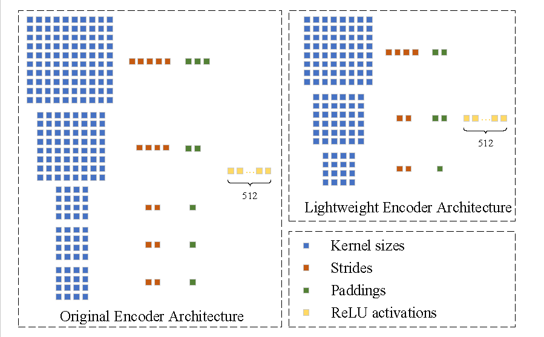
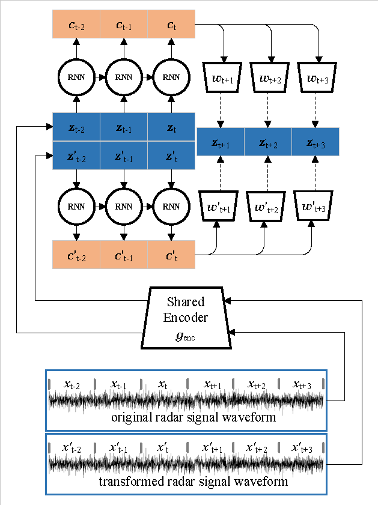

# MC-CPC
Multi-Channel Lightweight Contrast Prediction Coding for Feature Extraction of Radar Emitter Signals Detection on Wideband signal
## MC-CPC: Multi-Channel Lightweight Contrast Prediction Coding for Feature Extraction of Radar Emitter Signals Detection on Wideband signal

## Overview

This project implemented Multi-Channel CPC for Multi-Channel Lightweight Contrast Prediction Coding for Feature Extraction of Radar Emitter Signals. 

Specifically, to extract low pulse width radar signal features and meet the real-time requirements of signal identification, we design a lightweight 
encoder to realize the CPCfeature encoding function. Then, we construct a multi-channel CPC feature decoder to mine and extract subtle individual signal
 feature from the perspective of multi-domain and multi-channel information input. Simulation results verify the effectiveness of our proposed method, 
 which can achieve state-of-the-art results in both accuracy and running time compared to the existing optimal methods.

### Training datasets and test datasets

Relevant training data sets and Validation data sets see in ./datasets/.

### Example Output

> *Bounding box detection result of an time frequency spectrum of broadband signal

> *Predicted heatmap of object center points on an time frequency spectrum of broadband signal

### Best Model

> the trained model is placed on ./snapshot folder

This repository was developed and tested in PyTorch 1.5.

## How to run

- The installation dependency is very simple. The quick installation method is to install Anaconda3 + pytorch>1.0
- Relevant training data sets and Validation data sets see in ./datasets/
- Relevant training dataset lists and Validation dataset lists see in ./test/
- Modify signal dataset directory in ./run.sh and ./run_train_spk.sh
- Run ./run.sh for CPC feature training and Validation
- Run ./run_train_spk.sh for resnet training and Validation

## Results

> *the encoder genc is a strided convolutional neural network, which has three convolutional layers with kernel sizes [8,6,4], strides [4,2,2], paddings [2,2,1] and 512 hidden units with ReLU activations.*

> *An example image : The network loss function with epochs.*

> *The Fig shows the architecture of CPC model based on multi-channel decoder.*

> *Comparison of CPC training effects with different CPC network structures

> *Comparison of identification effects of Resnet with different CPC

